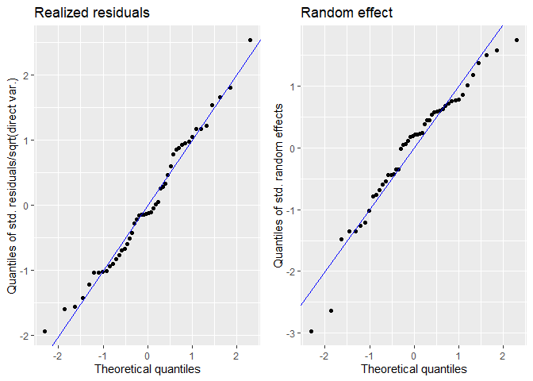

<!-- README.md is generated from README.Rmd. Please edit that file -->

# Poverty Mapping in Somalia : Reproducability Guidelines

<!-- badges: start -->
<!-- badges: end -->

The goal of somPovMap is to create a poverty map for Somalia using the
Small Area Estimation approach of the Fay Herriot Model (Fay and
Herriot, 1979). This ReadMe shows how to reproduce all the tables and
results in the paper. You can find the script that generates this readme
file as “README.Rmd” in this github working directory.

## System Set-Up

1)  Please clone the repository and open up the project within RStudio.
    Make sure you are in the project environment. In the top right
    corner you will see the “somPovMap” beside the R logo to show you
    are in the project’s environment. This is extremely important.
    Otherwise you cannot automatically load the user defined functions.

2)  Please install the R `devtools` package, run
    `install.packages("devtools")`

3)  Open `README.Rmd` and go ahead and knit the Markdown file. This file
    is basically running the script that produces the poverty map.

Please see code and outputs below:

4)  Please see the results in the paper below:

### Basic Descriptive Statistics

``` r

descriptives_dt <- 
  data.table(tot_pop_million = round(sum(spatial_dt$estimated_population_current, na.rm = TRUE)/1e6, 1),
             pop_hhs_million = round(sum(geosurvey_dt$population_weight, na.rm = TRUE)/1e6, 1),
             svy_hhs = nrow(geosurvey_dt),
             povrate_ipl = 
               geosurvey_dt %>%
               summarise(povrate_ipl = weighted.mean(x = poor,
                                                     w = population_weight,
                                                     na.rm = TRUE)) %>%
               round(4),
             recent_census = 1986 %>% as.integer(),
             region_count_sample = length(unique(geosurvey_dt$admin1Pcod[!is.na(geosurvey_dt$admin1Pcod)])),
             median_cv_region = 
               directpov_dt %>%
               summarize(median = median(directpov_dt$CV/100, na.rm = TRUE)),
             mean_cv_region = 
               directpov_dt %>%
               summarize(mean = weighted.mean(x = directpov_dt$CV/100, 
                                              w = directpov_dt$SampSize,
                                              na.rm = TRUE)),
             num_targets_pop = length(unique(spatial_dt$admin2Pcod[!is.na(spatial_dt$admin2Pcod)])),
             num_targets_sample = length(unique(spatial_dt$admin2Pcod[!is.na(spatial_dt$admin2Pcod)]))) %>%
  t() %>%
  kable()


descriptives_dt
```

|                         |              |
|:------------------------|-------------:|
| tot_pop_million         |   16.9000000 |
| pop_hhs_million         |   13.6000000 |
| svy_hhs                 | 6221.0000000 |
| povrate_ipl.povrate_ipl |    0.5135000 |
| recent_census           | 1986.0000000 |
| region_count_sample     |   17.0000000 |
| median_cv_region.median |    0.0980073 |
| mean_cv_region.mean     |    0.0974519 |
| num_targets_pop         |   74.0000000 |
| num_targets_sample      |   74.0000000 |

### FH Model Results and Diagnostics

This contains the results seen in Tables 3 & 4

``` r

summary(fhmodel_not)
#> Call:
#>  povmap::fh(fixed = as.formula(paste("Direct ~ ", paste(selvars_list, 
#>     collapse = "+"))), vardir = "var", combined_data = combine_dt, 
#>     domains = "targetarea_codes", method = "ml", MSE = TRUE, 
#>     mse_type = "analytical")
#> 
#> Out-of-sample domains:  26 
#> In-sample domains:  48 
#> 
#> Variance and MSE estimation:
#> Variance estimation method:  ml 
#> Estimated variance component(s):  0.0265102 
#> MSE method:  datta-lahiri 
#> 
#> Coefficients:
#>                       coefficients  std.error t.value               p.value    
#> (Intercept)              0.4992352  0.0322778 15.4668 < 0.00000000000000022 ***
#> prodmt_reg_shr_trof      0.0377582  0.0132481  2.8501              0.004371 ** 
#> share_pop_in_2km_grid   -0.0039392  0.0017801 -2.2130              0.026899 *  
#> ---
#> Signif. codes:  0 '***' 0.001 '**' 0.01 '*' 0.05 '.' 0.1 ' ' 1
#> 
#> Explanatory measures:
#>    loglike      AIC       BIC      KIC     AdjR2     FH_R2
#> 1 11.21415 -14.4283 -6.943498 -10.4283 0.2042772 0.2858004
#> 
#> Residual diagnostics:
#>                          Skewness Kurtosis Shapiro_W  Shapiro_p
#> Standardized_Residuals  0.2866244 2.506503 0.9810603 0.62340843
#> Random_effects         -0.8067306 3.786225 0.9514560 0.04570867
#> 
#> Transformation: No transformation
```

### Residual Plots and Q-Q plots

This contains the figures 1 in the paper and figure 4 in the appendix

``` r

plot(fhmodel_not)
```



    #> Press [enter] to continue


    #> Press [enter] to continue


### Poverty Maps

``` r

povshp_dt %>%
  ggplot() +
  geom_sf(aes(fill = FH)) +
  scale_fill_viridis(option = "H") +
  theme_bw() +
  labs(fill = "Poverty Rate")
```


``` r


povshp_dt %>%
  ggplot() +
  geom_sf(aes(fill = FH * estimated_population_current)) +
  scale_fill_viridis(option = "H") +
  theme_bw() +
  labs(fill = "Population \nof Poor")
```


### Comparing the Estimated and Direct Poverty Rates at Province Level

This is the figure 2 in the paper and the table 5 in the appendix

``` r

provpov_dt %>%
  ggplot(aes(x = admin1Name)) +
  geom_point(aes(y = provFH), color = "blue", size = 2) +  # Plotting provFH
  geom_errorbar(aes(ymin = DirectLB, ymax = DirectUB), width = 0.2, color = "red") +  # Error bars for DirectLB and DirectUB
  geom_hline(yintercept = 0, linetype = "dashed", color = "black") +  # Adding a horizontal line at y = 0
  labs(x = "Province", y = "Poverty Rate") +  # Labeling axes
  theme_bw() +  # Setting a white background theme
  theme(axis.text.x = element_text(angle = 45, hjust = 1))  # Rotating x-axis labels for better readability
```


``` r

provpov_dt[, c("admin1Name","Direct", "DirectLB", "DirectUB")] %>%
  kable()
```

| admin1Name      |    Direct |  DirectLB |  DirectUB |
|:----------------|----------:|----------:|----------:|
| Awdal           | 0.3426772 | 0.2538477 | 0.4315068 |
| Woqooyi Galbeed | 0.4272366 | 0.3395676 | 0.5149055 |
| Togdheer        | 0.4062082 | 0.3220723 | 0.4903441 |
| Sool            | 0.4502007 | 0.3477275 | 0.5526739 |
| Sanaag          | 0.3628377 | 0.2659533 | 0.4597222 |
| Bari            | 0.3660112 | 0.2845638 | 0.4474587 |
| Nugaal          | 0.3490663 | 0.2763029 | 0.4218297 |
| Mudug           | 0.6787627 | 0.5681693 | 0.7893562 |
| Galgaduud       | 0.5089052 | 0.4158070 | 0.6020035 |
| Hiraan          | 0.8153432 | 0.6996824 | 0.9310041 |
| Middle Shabelle | 0.8658882 | 0.7393780 | 0.9923985 |
| Banadir         | 0.4396671 | 0.3740864 | 0.5052479 |
| Lower Shabelle  | 0.5338817 | 0.4363581 | 0.6314054 |
| Bay             | 0.5716629 | 0.4618497 | 0.6814760 |
| Bakool          | 0.7432180 | 0.6318268 | 0.8546092 |
| Gedo            | 0.5214980 | 0.4186984 | 0.6242976 |
| Lower Juba      | 0.5782810 | 0.4675981 | 0.6889638 |
